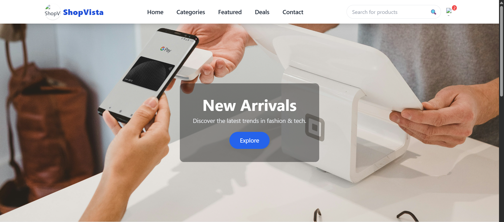

ShopVista Website

An e-commerce website that lets users **browse products, add items to the cart, and make purchases online**.  
Built with **HTML**, **CSS**, **JavaScript**, and optionally **Tailwind CSS**, ShopVista offers a clean and responsive shopping experience.

---

📄 Project Overview

ShopVista aims to simplify online shopping. Users can explore product categories, view product details, and add items to the cart for checkout. The website is **fully responsive**, providing a smooth experience on **desktop, tablet, and mobile devices**.

---

 📸 ShopVista UI

> 💡 User Interface.

  

---

 🔧 Features

- 🛒 Browse product categories and listings
- 📦 View product details with images and prices
- 🖥️ Fully responsive design for all devices
- 💬 Contact form for customer inquiries
- 🔗 Social media links
- ✨ Smooth navigation and animations

---

⚙️ Technologies Used

| Technology           | Purpose                                    |
|---------------------|--------------------------------------------|
| 🖥️ HTML             | Structure of the website                   |
| 🎨 CSS / Tailwind    | Styling and responsive layout              |
| ⚡ JavaScript        | Interactive elements and dynamic content  |
| 📱 Responsive Design | Ensures usability on all devices          |
| 🌐 Font Awesome      | Icons for social media and UI elements    |

---

